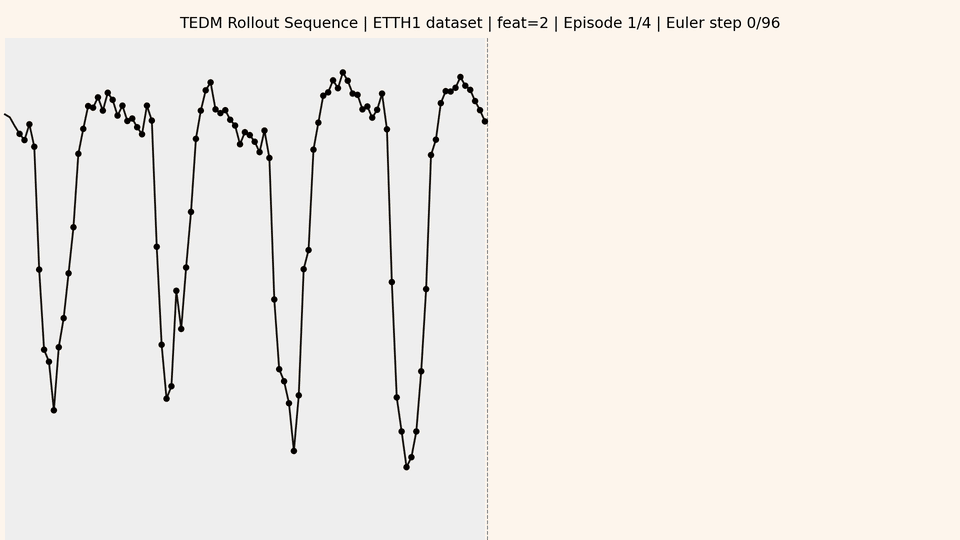

# TEDM: Time Series Forecasting with Elucidated Diffusion Models

This repository is the official implementation of **TEDM: Time Series Forecasting with Elucidated Diffusion Models** (ICLR 2026).

> Paper link: *coming soon*



---

## Requirements

Python 3.10 is required. To install dependencies:

```bash
python3.10 -m venv .venv
source .venv/bin/activate
pip install -r requirements.txt
```

---

### Downloading the datasets

Place all CSV files in the `data/` directory before running experiments.

| Dataset | Source |
|---------|--------|
| ETTh1, ETTh2, ETTm1, ETTm2, Weather, Exchange, Solar Energy | [iTransformer repository](https://github.com/thuml/iTransformer) |
| Stock | [Diffusion-TS repository](https://github.com/Y-debug-sys/Diffusion-TS) |

---

## Quick run

To verify the installation and confirm the full pipeline runs end-to-end:

```bash
python main.py --dataset etth1 --epochs 10
```

This overrides `trainer.max_epochs` to 10 and runs train + evaluation in a few seconds. Use any available dataset — just make sure the corresponding CSV is in `data/`.

---

## Training

To train TEDM on a dataset from the paper (e.g. ETTh1):

```bash
python main.py --dataset etth1
```

Test metrics (MSE, MAE) are printed automatically at the end of training. Results are saved to `results/etth1_00001/`.

For the full list of datasets, options, and instructions on training with your own data, see [USAGE.md](assets/USAGE.md).

---

## Evaluation

Evaluation runs automatically after training. To re-evaluate a saved checkpoint or sample forecasts:

```bash
python sample.py --dataset etth1 --indices 0,1,2 --period test --save-as-numpy
```

See [USAGE.md](assets/USAGE.md) for full sampling and plotting instructions.

---

## Plot

plot the specific indices of test window:

```bash
python -m utils.plot --run-folder results/etth1_00001 --sample-indices 0,1,2 --combine --output forecast.png
```

See [USAGE.md](assets/USAGE.md) for full sampling and plotting instructions.

---
## Results

TEDM achieves state-of-the-art results among diffusion-based forecasting methods on multiple benchmarks.
Forecast horizon: **96 steps**. Metric: **MSE / MAE** (lower is better).

### Diffusion-based methods comparison

| Dataset | TimeDiff | DiffusionTS | TMDM | ARMD | NsDiff | **TEDM (*)** |
|---------|----------|-------------|------|------|--------|----------|
| ETTh1 | 0.417 / 0.456 | 1.032 / 0.757 | 0.534 / 0.514 | 0.445 / 0.459 | 0.552 / 0.506 | 0.6643 / 0.5416 |
| ETTh2 | 0.364 / 0.393 | 3.017 / 1.340 | 0.564 / 0.517 | 0.311 / 0.338 | 0.460 / 0.452 | **0.2438** / **0.3374** |
| ETTm1 | 0.548 / 0.485 | 0.976 / 0.726 | 0.421 / 0.408 | 0.337 / 0.376 | 0.450 / 0.434 | 0.4596 / 0.4288 |
| ETTm2 | 0.209 / 0.296 | 3.517 / 1.472 | 0.313 / 0.350 | 0.181 / 0.255 | 0.250 / 0.328 | **0.1404** / **0.2568** |
| Exchange | 0.208 / 0.331 | 3.302 / 1.493 | 0.212 / 0.338 | 0.093 / 0.203 | 0.146 / 0.280 | **0.1004** / **0.2269** |
| Weather | 0.228 / 0.305 | 0.625 / 0.609 | 0.180 / 0.241 | 0.232 / 0.291 | 0.223 / 0.276 | 0.2711 / 0.2802 |

(*) We originally based our dataset processing pipeline on ARMD. We discovered critical [issues](https://github.com/daxin007/ARMD/issues/5) in their data handling later. We fixed them to match the protocol of the other methods and get the results of this table. So numbers differ from those in the paper, but conclusions remain the same. Due to this, we discard the results of ARMD and we compare with the rest of the methods.

---

## Contributing

This code is released under the [CC BY-NC-SA 4.0 license](LICENSE). Contributions via pull requests are welcome.

---

## Citation

If you use this code, please cite:

```bibtex
@inproceedings{tedm2026,
  title     = {TEDM: Time Series Forecasting with Elucidated Diffusion Models},
  author    = {Edgardo Solano Carrillo, Sreerag V Naveenachandran, Julia Niebling}
  booktitle = {International Conference on Learning Representations},
  year      = {2026}
}
```

---

## Acknowledgements

This codebase builds on and references the following works:

- [EDM](https://github.com/NVlabs/edm)
- [ARMD](https://github.com/daxin007/ARMD)
- [NsDiff](https://github.com/wwy155/NsDiff)
- [TimeDiff](https://github.com/MuhangTian/TimeDiff)
- [Diffusion-TS](https://github.com/Y-debug-sys/Diffusion-TS)
- [TMDM](https://github.com/LiYuxin321/TMDM)
- [iTransformer](https://github.com/thuml/iTransformer)
- [TimesNet](https://github.com/thuml/TimesNet)
- [DLinear](https://github.com/vivva/DLinear)
- [PatchTST](https://github.com/yuqinie98/PatchTST)
- [AliasFree-Diffusion-Models-PyTorch](https://github.com/MDFahimAnjum/AliasFree-Diffusion-Models-PyTorch)
- [Diffusion Models Beat GANs on Image Synthesis](https://github.com/openai/guided-diffusion)
